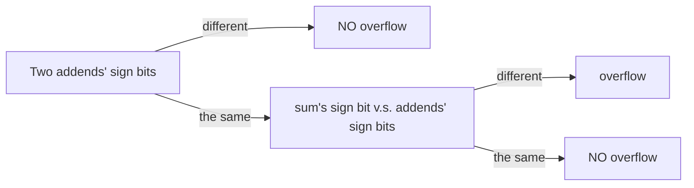

    

        
VE270 - Fall 2021

        
<b>RC1 Number Systems

        
 <b>TA: Wu You </b>

[toc]

# Unsigned Numbers

> Each bit of a number is associated with a ‘weight’, determined by the **base** of this number and the **position** of this bit.

## Decimal System

> Base: 10

It is the most familiar system to human. When dealing with other systems, decimal system helps us form a general understanding and serves as an **intermedia** during base conversion.

## Binary System

> Base: 2 (Note: this ‘2’ is represented in decimal, decimals are everywhere!)

### Conversion to Decimal

### Conversion from Decimal

> As for decimal integers:

- Subtraction Method

  

- Division Method

  > repeated-division-by-**base**

  

> As for decimal fractions:

- Multiplication Method (reserve a reasonable number of bits)

  > repeated-multiplication-by-**base**

  

## Other Systems

> Hexadecimal System: Base 8

> Octal System: Base 8

> Ternary System: Base 3

> ...

Conversion between other systems and decimal system: It is nothing other than what has been discussed previously. Subtraction Method, Division Method, and Multiplication Method all apply.

Conversion between other systems and binary system: Not only can number of the form $2^n$ be a base, but any other integers also work. As for former ones, direct conversion can be conducted (It would help if you are familiar with the table attached below). However, as for latter ones, such procedure is much more complicated and decimal numbers can serve as an intermedia.

# Signed Numbers

In this chapter, we first focus on binary numbers, and then, number systems with base $2^n$. Other number systems, like ternary system, will not be covered.

## Representation

How to represent it if target number is negative?

### sign and magnitude representation

> MSB (first bit on the left): sign bit (0->positive, 1->negative)
>
> rest bits: magnitude of target number

e.g. -3~10~ = 1011~2~

### 1’s complement representation

> D2B: Negate every bit of the magnitude of target number.
>
> B2D: Determine $\pm$ from sign bit. Negate every bit to obtain magnitude.

e.g. -3~10~ = 1100~2~

### 2’s complement representation 

> D2B: Negate every bit of the magnitude of target number, then plus one.
>
> B2D: Determine $\pm$ from sign bit. Minus one, then negate every bit to obtain magnitude.

> (Good to know) This representation assures that logics of addition and subtraction are identical. Therefore, subtraction can always be converted to addition. 

e.g. -3~10~ = 1101~2~

## Detecting Overflow

If an n-bit 2’s complement number is out of range (greater than $2^{n-1}-1$ or less than $-2^{n-1}$), we say there is an overflow. There are 2 ways to detect it.

### Method 1

### Method 2

If MSB and second MSB of carry bits are different, overflow is detected and vice versa.

To understand this method, refer to https://stackoverflow.com/questions/11352321/how-is-overflow-detected-at-the-binary-level.

# Simple Exercises

See blackboard.
