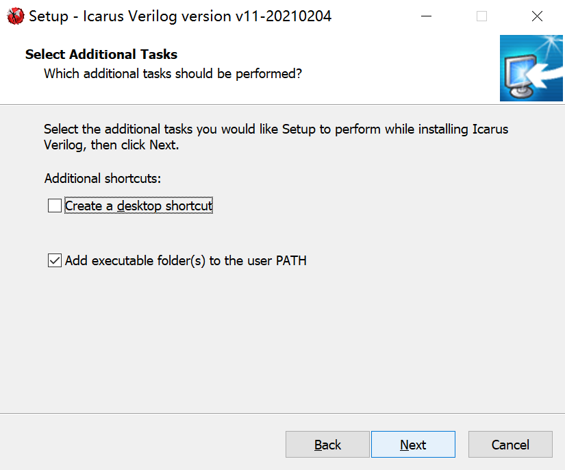

# An Alternative for Vivado Simulation (Optional)[^1]

[TOC]

## Introduction

> ***Vivado*** is a very important software supporting ***Verilog language*** in *VE270 Intro. to Logic Design*. It is a very powerful software to logic circuit design. However,

- The vivado editor is not quite user-friendly so we recommend `VSCode` and `Linter` here to write code.
- Launching *Vivado* is quite time-consuming, especially when using it to simulate codes in the homework. We have to switch `VSCode` and  `Vivado` back and forth. Plus, the simulation part takes a relative long time. So, here we recommend `iverilog` and `gtkwave` to quickly simulate codes. 
- and some installation problems of `Vivado` ......

​         Therefore,  to improve experience in logic design by *Verilog* and shorten the design cycle in labs, a substitution for *Verilog development and simulation* is recommended here. However, to some extent, we still need to <font color="red">rely on Vivado to implement the circuit on FPGA board </font>.


## Icarus Verilog and Gtkwave Installation

> #### Introduction: 
>
> - [Icarus Verilog](http://iverilog.icarus.com/) is a free compiler implementation for the IEEE-1364 Verilog hardware description language. Icarus is maintained by Stephen Williams and it is released under the [GNU GPL license](http://www.gnu.org/licenses/gpl.html). [^2]
>
> - GTKWave is a fully featured [GTK+](http://www.gtk.org/) based wave viewer for Unix, Win32, and Mac OSX which reads LXT, LXT2, VZT, FST, and GHW files as well as standard Verilog VCD/EVCD files and allows their viewing. [^3]

[^2]:Retrieved from http://bleyer.org/icarus/ "Icarus Verilog website"
[^3]: Retrieved from http://gtkwave.sourceforge.net/


#### Windows Installation

> **Installation Procedures**:
>
> - Go to [Icarus Verilog](http://bleyer.org/icarus/) website and download the proper package ([iverilog-v11-20210204-x64_setup.exe](http://bleyer.org/icarus/iverilog-v11-20210204-x64_setup.exe))
> - Accept the license and go through all the procedures. <font color="red">Please remember to check the following procedures</font>
> - **Attention**: `GTKWave` is <font color="red">included</font> in the latest `Icarus Verilog` package.

- Remember to click `Install GTKWave (x64)` button (by default it is chosen)

<div align = center> </div>

  - Remember to `Add executable folder(s) to the user PATH`

    <div align=center> </div>

> **Alternative Installation Method**
>
> - You can also use `chocolatey` to install iverilog and gtkwave from terminal. `Chocolatey` in Windows resembles `apt-get` in Linux.

> **Check Installation**: 
>
> - Go to `powershell.exe` to check the installation. 
> - Click `Win + X` and then choose `Powershell`
> - Execute the following command-line instructions respectively
>   - `iverilog -v`  to print the version of icarus verilog
>   - `gtkwave --version` to print the version of gtkwave
> - and you will see something similar as below

  <div align=center></div>

> - Successfully install in Windows now!


#### Windows Subsystem for Linux (WSL) installation

> **Before start**: since now the GUI of wsl is not supported for all windows system, installation of `iverilog in WSL` [^4]has to be <font color="red">combined with </font>installation of `GTKWave in Windows`, which you can refer to the previous part. But, I still recommend WSL installation, because we can use `Makefile` as a tool to manage our source code. (Though you can also use `Makefile` in Windows, which will be mentioned at the end of this tutorial.)

[^4]: Instructions for `WSL` installation: [install by Powershell](https://docs.microsoft.com/en-us/windows/wsl/install) or [manual installation](https://docs.microsoft.com/en-us/windows/wsl/install-manual)

> **Preparation for installation**: change the software source of your `WSL` to speed up the downloading

- Type in `sudo vim /etc/apt/sources.list` to edit the file `/etc/apt/sources.list`
- Press `dd` until all the lines are cleaned
- Copy the mirrors of the software source to  the file`/etc/apt/sources.list`
  - some mirrors: [Aliyun](https://developer.aliyun.com/mirror/ubuntu) and [Tuna](https://mirrors.tuna.tsinghua.edu.cn/help/ubuntu/) 
  - not try `Ctrl + V` in WSL, instead just click the right (mouse) button
- Click `Esc` to exit the "edit mode"
- Press `Shift + Z + Z` to exit the file to the command line: quickly click `Z` twice while pressing `Shift`
- Type in `sudo apt-get update` in the command line to retrieve the new lists of package
> **Installation Procedures**:
- Type in `sudo apt install make iverilog` to install `make` and `iverilog`

> **Check Installation**: type in `iverilog -v` and `make -v` respectively (shown below)

<div align=center></div>

> - Successfully install in WSL now!


#### Linux Installation

> **Installation Procedures**: 
>
> - Open the terminal and retrieve the newest package list `sudo apt-get update` 
> - Type in `sudo apt install make iverilog gtkwave`

> **Installation Check**: type `gtkwave --version` in the terminal. If you also see some similar problems with regard to `canberra-gtk-module`, fix it by `sudo apt install libcanberra-gtk-module`. Similarly, check `iverilog` and `make` respectively by `iverilog -v` and `make --version`

> - Successfully install in Linux now!


#### Mac Installation [^5]

[^5]: https://zhuanlan.zhihu.com/p/357988583 MacOS tutorial

> **Installation Procedures**: 
>
> - Ignore this step if you have already installed homebrew:
>
>   - Open the terminal and type`/bin/zsh -c "$(curl -fsSL https://gitee.com/cunkai/HomebrewCN/raw/master/Homebrew.sh)"`
>
>   - Choose mirror: [ustc](http://mirrors.ustc.edu.cn/help/homebrew-cask.git.html)
>
>   - Enter your password whenever it asks you to do so
>
> - To install iverilog, type in terminal `brew install icarus-verilog` 
>
> - To install gtkwave, 
>
>   - Type in terminal`brew install gtkwave`
>   - Edit environment variables using vim:
>     - Type `vim ~/.zshrc` in terminal and press `Enter`
>     
>     - Vim GUI will show up, navigate to the line shown below and press `I` on your keyboard to enter the edit mode of vim
>     
>       <div align=center><div>
>     
>     - Copy this line `source ~/.bash_porfile` using `Ctrl+Shift+V` and press `esc` to escape from edit mode
>     
>     - Press `:`+`w`+`q`+`Enter` to save your changes and leave from Vim GUI
>     
>     - Now you are back in terminal again type `vim ~/.bash_profile` in terminal and press `Enter`
>     
>     - Vim GUI will show up again, navigate to the line shown below and press `I` on your keyboard to enter the edit mode of vim
>     
>       <div align=center><div>
>     
>     - Copy this line `export PATH="/Applications/gtkwave.app/Contents/Resources/bin:$PATH"` using `Ctrl+Shift+V` and press `esc` to escape from edit mode
>     
>     - Press `:`+`w`+`q`+`Enter` to save your changes and leave from Vim GUI
>   - After finishing previous steps, if you want to open gtkwave simulation result directly from terminal, Enter `open xxx.vcd` or `open -a gtkwave xxx.vcd`, where `xxx` should be figured out by yourself.

> **Check Installation**: type `iverilog` in the terminal. If you see its user guide popping up in terminal...... 

> Successfully install in Mac now!


## Programming in VSCode

> **Useful Verilog Extensions for VSCode** : [^6]
>
> - `Verilog-HDL/SystemVerilog/Bluespec SystemVerilog support for VS Code`
>
>   - go to the setting to customize by pressing `Ctrl + ,`
>
>   - search `@ext:mshr-h.veriloghdl` or just go to its extension setting
>
>   - choose `iverilog` in `Verilog > Linting: Linter`
>
>   - reload the windows, then it can check the syntax for `Verilog code`
>
>     <div align=center><div>
>
> - `verilog formatter` , `Verilog Snippet` and ......
>

[^6]: VSCode can be installed from [Visual Studio Code](https://code.visualstudio.com/)


### Simple Instructions on how to use Iverilog and GTKWave [^7]

> **Sample Code for D Flip-flop and testbench** : create a source code file `dff.v` and a test code file `dff_tb.v` in the same fold. The codes shown below are original codes accepted by verilog. The following procedures will show how to adapt them to `iverilog` and `gtkwave`. The general idea is to change the test code `dff_tb.v`

``` verilog
// dff.v
module dff (
    input D,
    input clk,
    output reg Q
);
    always @(posedge clk) begin
        Q <= D;
    end
endmodule
```

```verilog
// dff_tb.v
module dff_tb;
	parameter half_period=50;
	
    reg Din;
  	wire Qout;
  	reg clock;

  	dff UUT (.D(Din),.clk(clock),.Q(Qout));
  

  	initial begin
     	#0 Din = 1'b0; clock = 1'b0;
  		#25 Din = 1'b1;
  		#100 Din = 1'b0;
  	end
  
  	always #half_period clock = ~clock;
  	initial #300 $stop;
    
endmodule
```


> - Include the module source code in the beginning of testbench code. In this case, there is only one module source code`dff.v` and only one testbench code `dff_tb.v` 
>
> - Include the code that generates `.vcd` file (wave file)
> - Pay attention to `$dumpfile("wave.vcd")` and `$dumpvars(0, dff_tb)` (see notation below)


```verilog
// the new dff_tb.v file

// include the module source code
`include "dff.v"

module dff_tb;
  	parameter half_period=50;

  	reg Din;
  	wire Qout;
  	reg clock;

  	/*iverilog*/
  	initial begin     
    	// here you define "wave.vcd" actually is the name of the generated wave file
    	$dumpfile("wave.vcd");
    	// keep consistent here: the second entry should be the same name of this testbench module "dff_tb"
    	$dumpvars(0, dff_tb);
  	end
  
  	dff UUT (.D(Din),.clk(clock),.Q(Qout));
  

  	initial begin
     	#0 Din = 1'b0; clock = 1'b0;
  		#25 Din = 1'b1;
  		#100 Din = 1'b0;
  	end
  
  	always #half_period clock = ~clock;
  	initial #300 $stop;
    
endmodule
```


> Some instructions of iverilog and gtkwave:
>
> - `iverilog -o test dff_tb.v `: you can treat `iverilog` like `g++` in C++ language. It complies `dff_tb.v` and generates the executable file `test`
> - `vvp -n ./test -lxt2`: `./test`to execute `test` and `vvp`to generate the wave file
> - `gtkwave ./wave.vcd`: open the generated wave file by `GTKWave`. <font color="red"> Notice:  `./wave.vcd` is the name you define in the testbench file `dff_tb.v`</font>
> - for more details, you can search it online or type `man iverilog`/`man vvp` to see the built-in documentation
> - To sum up, for simulation of D Flip-flop here, you need to successively <font color="red">execute the following instructions in the same fold  of your source code</font>


```
iverilog -o test dff_tb.v
vvp -n ./test -lxt2
gtkwave ./wave.vcd
```


#### Further Improvement

##### Windows

> **For windows users**, you can write them in  `Makefile`  file.
>
> For example, copy the below code in a new file `Makefile`, open the terminal (`Ctrl + J` in VSCode) and type in `mingw32-make all`. You will see that it executes automatically (shown below). To clean the previous files, run `mingw32-make clean`.
>
> Install `GNU make`. For example, you can execute `mingw32-make` as far as you install `MinGw`before in VG101. 

```makefile
all:test
	vvp -n ./test -lxt2
	gtkwave ./wave.vcd
test: dff.v dff_tb.v
	iverilog -o test dff_tb.v 
clean:
	del /p test wave.vcd
```
<div align=center><div>


##### Mac/Linux

>
> For Linux/Mac users, since you can't open the gtkwave GUI, you have to rely on gtkwave in Windows. But here I use `Makefile` to demonstrate. Importantly, make sure you can execute `make`  in the terminal
>
> In the same folder of source code, create a file named `Makefile` without any file suffixes. Copy the following into it.

```makefile
all:test
	vvp -n ./test -lxt2
	gtkwave ./wave.vcd
test: dff.v dff_tb.v
	iverilog -o test dff_tb.v 
clean:
	rm -rf test wave.vcd
```


> Further explanation:
>
> It will be taught carefully in VE280, so no detailed explanation here.
>
> - `test: dff.v dff_tb.v`: replace your all source code name after the colon. For example, in D Flip-flop, we only have`dff.v` and `dff_tb.v`
> - `wave.vcd` in `gtkwave ./wave.vcd` and `rm -rf test wave.vcd`: the name of wave file defined in the testbench file (`dff_tb.v`).
> - `test` in `vvp -n ./test -lxt2 ` ,  `iverilog -o test dff_tb.v ` and  `rm -rf test wave.vcd`: the executable file generated by `iverilog` and keep consistent in these three commands


> How to execute in the Mac/Linux environment: open the terminal
>
> - `make test`: only executes `iverilog -o test dff_tb.v `
>- `make all`: first execute `make test` and then `vvp -n ./test -lxt2` and `gtkwave ./wave.vcd`. So, in most cases, you directly type in `make all` in the terminal. It will automatically launch `GTKWave`.
> - `make clean`: delete the files `test` and `wave.vcd`. For safety before every `make all`, execute `make clean` to clean the out-of-date file
> - for demo, please see in `WSL` part as they are similar.


##### WSL

> For WSL users, you can refer to `Mac/Linux` part to understand the principals, but you may change `Makefile` a little bit
>
> Change `gtkwave ./wave.vcd` to `powershell.exe gtkwave ./wave.vcd`

```makefile
all:test
	vvp -n ./test -lxt2
	powershell.exe gtkwave ./wave.vcd
test: dff.v dff_tb.v
	iverilog -o test dff_tb.v 
clean:
	rm -rf test wave.vcd
```

<div align=center></div>


#### GTKWave: Wave Viewer


> - Click `dff_tb` under `SST`
> - Click `Din[0]` ... under `Signals`
> - Then you can see the green line showing the simulation result now!
> - Here is the sample simulation result for D Flip-flop   


### Further Exploration 

> To create, manage, simulate, implement and write-bitstream verilog without opening vivado, you can refer to `Makefile` and the project folder below.

> - Give special credits to VE270-SU21 TA Wu Qinhang

```makefile
# proj=ve270lab5

##### Examples

## make build-project proj=ve270lab5
## make sim proj=ve270lab5 tb=clock_tb
## make write-bitstream proj=ve270lab5
## make program-fpga bs=bitstream_files/ve270lab5.bit

##### VE270-SU21 Verilog Workshop 
##### Editer: VE270-SU21 TA Wu Qinhang
##### Credit: VE427-SU21 TA Yuan Yichao
##### Credit: UCB EECS151-FA20 Teaching Group
#####

VERILOG_SRCS = src/*.v

.PHONY: build-project
$(vivado_proj_file) build-project: $(VERILOG_SRCS)
		vivado -mode batch -source scripts/build_project.tcl -tclargs $(proj)

.PHONY: sim
sim: $(vivado_proj_file)
		vivado -mode batch -source scripts/sim.tcl -tclargs $(proj) $(tb)

.PHONY: impl
impl: $(vivado_proj_file)
		vivado -mode batch -source scripts/impl.tcl -tclargs $(proj)

.PHONY: write-bitstream
write-bitstream: $(vivado_proj_file)
		vivado -mode batch -source scripts/write_bitstream.tcl -tclargs $(proj)

.PHONY: program-fpga
program-fpga:
		vivado -mode batch -source scripts/program_fpga.tcl -tclargs $(bs)

.PHONY: clean
# "make clean" won't remove your project folders
clean:
		rm -rf *.log *.jou *.str *.tar
```

<div align = center></div>

[^7]: https://zhuanlan.zhihu.com/p/95081329 iverilog + gtkwave tutorial


[^1]: Written by <frankling@sjtu.edu.cn> and <lauren_you.wu@sjtu.edu.cn>

